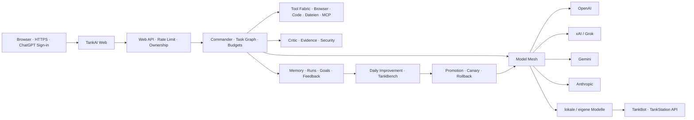

# TANKAI – VERBINDLICHER MASTERPLAN

Version: 5.3.0
Projektlinie: TankAI Web → TankAI Core → TankAI-Modellfamilie → TankBot/TankStation
Statusdatum: 13. August 2026
Leitentscheidung: Webprodukt zuerst, eigener Modellstack schrittweise, jede Überlegenheit messbar

## 1. Ergebnis, das entstehen muss

TankAI wird eine über das World Wide Web erreichbare allgemeine KI-Plattform. Ein Nutzer öffnet
eine HTTPS-Adresse, meldet sich an, spricht natürlich mit TankAI, gibt größere Ziele ab und sieht
eine einzige klare Antwort. Im Hintergrund plant ein Commander, verteilt Teilaufgaben an passende
Modelle, lässt Ergebnisse prüfen, benutzt freigegebene Werkzeuge und hält den Projektzustand über
Sitzungen hinweg.

Das Endprodukt besteht aus vier realen Ebenen:

1. **TankAI Web** – Browserprodukt, Identität, Chat, Ziele, Dateien, Status und Bedienung.
2. **TankAI Runtime** – Planung, Providerteam, Werkzeuge, Gedächtnis, Receipts und Wiederaufnahme.
3. **TankAI Improvement System** – Feedback, Evals, Candidates, Canary und Rollback.
4. **TankAI Model Family** – eigene Router-, Critic-, Core-, Code- und Music-Checkpoints.

TankAI ist erst vollständig, wenn alle vier Ebenen produktiv, geprüft und miteinander verbunden
sind. Bis dahin nennt jeder Release exakt seinen Reifegrad.

## 2. Was „besser als ChatGPT, Grok und andere“ technisch bedeutet

Das Projekt übernimmt keine pauschale Behauptung. Es setzt ein härteres Abnahmesystem.

Für jede Aufgabenklasse wird ein eingefrorener **TankBench** gebaut. TankAI und die jeweils
verglichenen Systeme bearbeiten dieselben Aufgaben unter vergleichbaren Budgets. Bewertet werden:

| Dimension | Messung |
| --- | --- |
| Zielerfüllung | vollständig erfüllte Definition-of-Done-Kriterien |
| Faktentreue | korrekte Claims / alle prüfbaren Claims |
| Quellenqualität | direkte, aktuelle und tatsächlich tragende Quellen |
| Ausführung | echte Artefakte und erfolgreiche Action Receipts |
| Code | Build-, Test- und Regressionserfolg |
| Fehlererholung | erfolgreiche Reparatur nach absichtlichem Teilausfall |
| Gedächtnis | Precision, Recall, Konflikt- und Ablaufbehandlung |
| Sicherheit | kritische Verstöße, Datenabfluss, Injection- und Rechtefehler |
| Bedienung | Zeit bis zum nutzbaren Ergebnis, unnötige Rückfragen, Abbruchrate |
| Effizienz | Latenz, Modellaufrufe, Tokens und Kosten |

Ein Sieg wird nur pro Version, Aufgabenklasse, Korpus und Datum ausgewiesen. Kritische
Sicherheitsverstöße sperren einen Sieg unabhängig vom Durchschnittswert. Eloquenz ist keine
Ersatzmetrik.

## 3. Ehrliche Modellstrategie

Ein Frontier-Grundmodell von null benötigt sehr große Daten-, Rechen-, Energie- und
Spezialistenressourcen. Diese Ressourcen sind im aktuellen Projekt nicht belegt. TankAI beginnt
deshalb nicht mit einer erfundenen „eigenen Super-KI“, sondern mit einem kontrollierten
Compound-System und baut daraus eigene Modelle.

Die Strategie:

1. heute verfügbare starke Modelle über stabile Provideradapter nutzen,
2. deren Aufgabenverteilung, Gedächtnis, Werkzeuge und Prüfung selbst besitzen,
3. nur rechtmäßig nutzbare, verifizierte Trainingssignale erfassen,
4. zuerst eigene kleine Router- und Critic-Modelle trainieren,
5. danach ein offenes Basismodell zu Tank Core feinabstimmen,
6. Spezialmodelle für Code und Musik entwickeln,
7. erst bei nachgewiesenem Nutzen und vorhandenen Ressourcen größere Pretrains starten.

Damit entsteht früh ein echtes Produkt und später ein echtes eigenes Modell, ohne den zweiten
Schritt vorzutäuschen.

## 4. Nicht verhandelbare Projektregeln

1. Keine Platzhalter, Fake-Endpunkte oder festen Scheinantworten als Produktfunktion.
2. Keine Aktion ohne Receipt und keine Testbehauptung ohne tatsächlichen Testlauf.
3. Web ist Hauptoberfläche; lokale Komponenten sind Worker oder Integrationen.
4. Modelle, Speicher und Werkzeuge bleiben austauschbar.
5. Nutzeridentität und Eigentum werden bei jeder serverseitigen Datenoperation geprüft.
6. Provider-Schlüssel bleiben serverseitige Secrets.
7. Private Daten werden nicht automatisch Trainingsdaten.
8. Kein Agent gibt seine eigene riskante Arbeit allein frei.
9. Kein tägliches Lernen ohne eingefrorenen Korpus, Promotion Gate und Rollback.
10. Kein Marketingtitel „beste KI“ ohne reproduzierbaren Vergleich.
11. TankAI bleibt getrennt von TankStation und kommuniziert über eine versionierte lokale API.
12. KI-Code läuft nie im Echtzeit-Audio-Thread.
13. Bestehende Nutzerarbeit wird fortgesetzt und nicht durch alte Stände ersetzt.
14. Jeder Meilenstein endet in einem nutzbaren Artefakt, nicht nur in einem Dokument.

## 5. Zielarchitektur



## 6. TankAI Web

### 6.1 Öffentliche Fläche

- stabile HTTPS-Adresse,
- verständliche Produktdefinition ohne erfundene Fähigkeiten,
- sichtbarer Release- und Betriebsstatus,
- Anmeldung zur Arbeitsoberfläche,
- öffentliche Benchmark- und Sicherheitsmethodik,
- responsive und barrierearme Bedienung.

### 6.2 Geschützte Arbeitsoberfläche

- natürliches Chatfenster,
- Modi Schnell, Team und Tiefenprüfung,
- Gesprächsverlauf pro Nutzer,
- sichtbare Teamphasen und beteiligte Modelle,
- keine Ausgabe verborgener Gedankengänge,
- Feedback und präzise Korrektur pro Run,
- klare Fehlerzustände,
- langlebige Ziele mit Zustandsverlauf, bestätigtem Schritt und nächster sicherer Aktion,
- Projektbereiche mit versionierten Text-, Markdown- und JSON-Dateien,
- später: Binärdateien und Sprache.

### 6.3 Serverregeln

- Identität aus vertrauenswürdigen, serverseitig gelieferten Authentifizierungsdaten,
- datensparsame Hash-ID in Datenbank und Modell-Sicherheitskennung,
- parametrisierte Datenbankabfragen mit Mandantenfilter,
- Eingabe- und Ratenlimits,
- harte Call-, Token-, Zeit- und Kostenbudgets,
- feste Providerziele,
- keine Provider-Schlüssel im Client,
- Security Header, sichere Fehlertexte und Secret-Redaction.

## 7. TankAI Runtime

### 7.1 Commander

Der Commander erstellt für jede nicht triviale Anfrage:

- Ziel,
- Definition of Done,
- Risiko- und Datenklasse,
- Task-Graph,
- Modell- und Werkzeugbudget,
- Prüfkriterien,
- Recovery- und Abbruchstrategie.

Er beendet eine Aufgabe nicht, solange ein geplanter Pflichtschritt unbestätigt fehlt.

### 7.2 Teammodi

| Modus | Ablauf | Maximales Standardbudget |
| --- | --- | --- |
| Schnell | stärkstes geeignetes Modell, Endprüfung im Prompt | 1 Modellaufruf |
| Team | Planner, 2 Spezialisten, Critic, Synthesizer | 5 Modellaufrufe |
| Tief | Planner, bis 3 Spezialisten, 2 unabhängige Critics, Synthesizer | 7 Modellaufrufe |

Budgets sind Obergrenzen. Unnötige Aufrufe werden ausgelassen. Wenn mehrere Provider aktiv sind,
bevorzugt Critic oder Synthesizer eine andere Modellfamilie als der Hauptspezialist.

### 7.3 Provider Mesh

Erste produktive Adapter:

- OpenAI Responses API,
- xAI Responses/OpenAI-kompatible API,
- Anthropic Messages API,
- Gemini GenerateContent API,
- validierter eigener OpenAI-kompatibler Endpunkt.

Ein Adapter besitzt feste Basisadresse, Authentifizierungsart, Modell-ID, Rollen, Timeouts,
Tokenlimit und normalisierte Antwort. Nutzerinhalt darf keine Provideradresse bestimmen.

### 7.4 Run Receipt

Jeder Run speichert mindestens:

```json
{
  "runId": "stabile UUID",
  "conversationId": "stabile UUID",
  "userId": "datensparsamer Hash",
  "promptVersion": "2.1.0",
  "mode": "team",
  "status": "completed",
  "providerTrace": [
    {
      "role": "engineer",
      "provider": "openai",
      "model": "gpt-5.6-sol",
      "status": "completed",
      "latencyMs": 4200
    }
  ],
  "modelCalls": 5,
  "elapsedMs": 9100,
  "createdAt": "ISO-8601"
}
```

Candidate-Rohtexte und Geheimnisse gehören nicht in diesen Trace.

## 8. Gedächtnis und langlebige Ziele

### 8.1 Speicherklassen

- Conversation: sichtbare Nutzer- und Endantworten.
- Project: Architektur, Entscheidungen, Dateien und Fortschritt.
- Preference: bestätigte Präferenzen.
- Semantic: belegte Fakten mit Ablauf.
- Procedure: geprüfte Skills.
- Failure: reproduzierbare Fehlerursachen und Reparaturen.
- Eval: eingefrorene Aufgaben, Referenzen und Resultate.

### 8.2 Eigentum und Löschung

Jede Abfrage enthält die serverseitig ermittelte Nutzer-ID. Datenexport, Korrektur, Ablauf und
Löschung werden vor der allgemeinen Produktionsfreigabe implementiert. E-Mail-Adressen werden
nicht als Primärschlüssel oder Modellkennung verwendet.

### 8.3 Zielzustände

`draft → planned → ready → running → waiting → verifying → completed | failed | cancelled`

Ein Neustart darf Ziel, letzten bestätigten Schritt, Receipts und nächste sichere Aktion nicht
verlieren.

## 9. Daily Improvement System

### 9.1 Erlaubte Lernsignale

- explizites Nutzerfeedback,
- Nutzerkorrekturen,
- fehlgeschlagene Receipts,
- Build- und Testergebnisse,
- Quellen- und Evidence-Prüfungen,
- Latenz, Kosten und Providerausfälle,
- freigegebene öffentliche oder lizenzierte Trainingsdaten.

### 9.2 Verbotene Lernsignale

- private Gesprächsrohdaten ohne ausdrückliche Einwilligung,
- Geheimnisse und Zugangsdaten,
- Candidate-Antworten als Referenzwahrheit,
- fremde proprietäre Modellantworten außerhalb erlaubter Nutzung,
- nach Candidate-Sicht ausgewählte Benchmarkfälle,
- bloße Nutzerverweildauer als Qualitätsbeweis.

### 9.3 Täglicher Lauf

1. abgeschlossene und fehlgeschlagene Runs selektieren,
2. Daten minimieren und sensible Inhalte entfernen,
3. Fehlercluster bilden,
4. höchstwertigen reproduzierbaren Fall wählen,
5. Baseline und genau einen Candidate einfrieren,
6. vollständige Golden- und Safety-Suites ausführen,
7. Qualität, Sicherheit, Latenz und Kosten vergleichen,
8. Candidate verwerfen oder zum Canary freigeben,
9. Canary überwachen und bei Regression zurückrollen,
10. Improvement Receipt veröffentlichen.

Der Scheduler darf Candidates erzeugen, aber keine G3- oder G4-Änderung ohne die vorgesehene
Freigabe aktivieren.

## 10. TankAI-Modellprogramm

### 10.1 Tank Router

Zweck: Aufgabenklasse, Risiko, Modalität und bestes Modell-/Toolprofil wählen.

- Eingabe: minimierte Auftragsmerkmale und verfügbare Fähigkeiten,
- Ausgabe: Rollen, Providerreihenfolge, Budget und Unsicherheit,
- Trainingsdaten: freigegebene Run-Metadaten und verifizierte Outcomes,
- Primärmetriken: Routing-Regret, Completion Rate, Kosten und kritische Fehlroute,
- erste Zielgröße: klein genug für CPU- oder Edge-Inferenz.

### 10.2 Tank Critic

Zweck: unbelegte Claims, Zielauslassungen, Action-Receipt-Widersprüche, Injection und
Sicherheitsfehler erkennen.

- positives Material: verifizierte gute Endergebnisse,
- negatives Material: reproduzierbare Fehlerfälle und kontrollierte Mutationen,
- keine Bewertung eigener Trainingsantworten ohne unabhängige Referenz,
- hoher Recall für kritische Fehler, kalibrierte Unsicherheit.

### 10.3 Tank Core

Zweck: allgemeiner Dialog, Planung, Toolverträge, Deutsch/Englisch und Projektkontinuität.

Stufen:

1. offenes Basismodell nach Lizenz-, Qualität- und Hardwareprüfung auswählen,
2. Tokenizer- und Sprachabdeckung messen,
3. rechtmäßigen Instruction-/Tool-/Recovery-Korpus erzeugen,
4. Supervised Fine-Tuning,
5. Preference-Optimierung nur mit unabhängigen Labels,
6. Safety- und Tool-Evals,
7. quantisierte Inferenzprofile,
8. signierter Modellcheckpoint und Modellkarte,
9. Shadow-Traffic,
10. begrenzter Canary.

### 10.4 Tank Code und Tank Music

Tank Code optimiert Repositoryverständnis, Patchgenauigkeit, Build-/Testschleifen und sichere
Werkzeugverwendung. Tank Music optimiert musikalische Repräsentation, MIDI, Arrangement,
Soundbeschreibung und erklärbare Varianten. Beide bleiben Spezialisten unter dem Commander und
dürfen den allgemeinen Sicherheitskern nicht umgehen.

### 10.5 Kein Frontier-Pretrain ohne Startgate

Ein Training von null beginnt erst, wenn vorhanden sind:

- dokumentierter Datenbestand und Lizenzen,
- dedizierter Datenschutz- und Sicherheitsprozess,
- Tokenizer- und Architekturentscheidung,
- Compute-, Speicher-, Energie- und Finanzbudget,
- verteilte Trainings- und Checkpoint-Infrastruktur,
- unabhängige Evals und Red Team,
- Abbruch-, Recovery- und Releaseplan.

Ohne dieses Gate wird kein „eigenes Frontier-Modell“ behauptet.

## 11. Fehlerregister und Gegenmaßnahmen

| Fehlerklasse | Verbindliche Gegenmaßnahme |
| --- | --- |
| Halluzination | Claims klassifizieren, aktuelle Quellen, Evidence Judge |
| falsche Aktionsbehauptung | Action Receipt als Freigabebedingung |
| Gefälligkeit | Critic prüft Grundannahme und Gegenargument |
| Kontextverlust | versioniertes Project Memory vor jeder Änderung |
| unnötige Rückfrage | Default-Policy und materielle-Frage-Gate |
| zu große Autonomie | Seiteneffektklassen und exakte Autorisierung |
| zu kleine Autonomie | sichere reversible Arbeit ohne Zwischenstopp |
| Plan statt Ergebnis | frühester echter Meilenstein und Artefaktpflicht |
| Teilprodukt als Gesamtprodukt | Release-Capability-Matrix |
| Mehrheitsfehler | Tests und Belege höher als Modellstimmen |
| Prompt Injection | Rangordnung, Datentrennung, Tool-Allowlist |
| veraltete API | offizielle Dokumentation und Versionsprüfung |
| ungetesteter Code | Build-/Test-Receipt |
| Secret Leak | serverseitige Secrets, Redaction, kein Client-Key |
| Mandantenleck | serverseitige User-ID in jeder Abfrage |
| Kostenexplosion | Modusbudgets, Rate Limits, Tokenlimits |
| stiller Teilausfall | degradierter Status und vollständiger Fehlertrace |
| regressives Lernen | vollständiger Golden-Korpus, Canary, Rollback |
| Eval-Gaming | eingefrorener Fingerprint und unabhängiger Richter |
| Anbieterlock-in | normalisierte Adapter und eigene Datenverträge |
| künstliche Länge | Relevanz- und Wiederholungsprüfung |

Wettbewerber werden nur über reproduzierbare Black-Box-Evals verglichen. Das Fehlerregister
enthält keine unbelegten Markenurteile.

## 12. Sicherheits- und Betriebsstandard

Vor allgemeiner Freigabe müssen mindestens erfüllt sein:

- Threat Model für Prompt Injection, SSRF, XSS, CSRF, Auth-Bypass und Datenabfluss,
- serverseitige Autorisierung aller privaten Routen,
- Rate-, Kosten-, Laufzeit- und Größenlimits,
- parametrisierte D1-/SQL-Abfragen,
- Secret Management und Log-Redaction,
- Abhängigkeits- und Supply-Chain-Prüfung,
- Backup, Datenmigration und Recovery-Test,
- Audit-Receipts für externe Aktionen,
- Lösch- und Exportpfad,
- Last-, Fehler-, Chaos- und Canary-Tests,
- signierte, unveränderbare Releases.

NIST AI RMF, OWASP ASVS und die jeweils aktuelle OWASP-Risikoklassifikation für
LLM-/GenAI-Anwendungen dienen als externe Mindestorientierung. Maßgeblich bleiben konkrete Tests
im Produkt.

## 13. Releasephasen

### R0 – lokale Orchestrierungsbasis

Status: **implementiert und lokal geprüft als TankAI v0.4.0**.

Vorhanden:

- Provideradapter,
- Teamplanung, Spezialisten, Critic und Synthesizer,
- Goal-, Memory-, Tool- und Research-Basis,
- Golden-Evals, Candidates, Promotion und Rollback,
- versionierte Skills,
- kontrolliertes Routinglernen,
- Worker-Isolation und Secret-Redaction,
- 29 erfolgreiche Tests im archivierten Release.

Nicht öffentlich produktiv; JSON-Dateispeicher und lokaler Node-Server.

### R1 – echte Webgrundlage

Status: **als TankAI Web v0.5.0 implementiert und privat produktiv bereitgestellt**.

- öffentlich erreichbare Landingpage,
- geschützte ChatGPT-Anmeldung,
- D1-gesicherte Conversations, Runs, Quoten und Feedback,
- serverseitige Provider-Secrets,
- OpenAI-, xAI-, Anthropic-, Gemini- und Custom-Adapter,
- Schnell-, Team- und Tiefenmodus,
- Planner/Specialists/Critic/Synthesizer,
- sichtbarer, datensparsamer Teamtrace,
- verbindlicher Masterprompt v2.0.0 direkt in der Runtime,
- produktiver Build und HTTPS-Deployment.

Abnahme: Ein angemeldeter Nutzer sendet eine Nachricht, der Server führt einen echten Modelllauf
aus, speichert nur Endantwort und Metadaten unter der richtigen Nutzer-ID und liefert einen
prüfbaren Run-Trace. Ohne Provider-Secret meldet das System ehrlich einen Konfigurationsblocker.

### R1.1 – ehrliche Receipts und Improvement Control

Status: **als TankAI Web v0.6.0 implementiert, geprüft und privat bereitgestellt**.

- Ausführungsabschluss, Faktenverifikation und Benchmarkstatus getrennt ausweisen,
- kein „VERIFIED“ allein aufgrund erfolgreicher Modellaufrufe,
- maschinenlesbarer TankBench-Vertrag mit deterministischem Promotion Gate,
- SHA-256-Fingerprint für eingefrorene Eval-Korpora,
- negative, korrigierte Antworten als unveränderbare Lernfälle vormerken,
- Nutzerstatus für Feedback, Warteschlange und Mutationssperren,
- Provider-Bereitschaft und unabhängige Modellfamilien ehrlich diagnostizieren.

Abnahme: Ein Run erzeugt ein Execution Receipt, das erfolgreiche und fehlgeschlagene Schritte
zählt und inhaltliche Verifikation ausdrücklich nicht vortäuscht. Eine korrigierte negative
Bewertung erzeugt einen referenzierten Lernfall. Kein Lernfall kann ohne TankBench-Promotion Gate
Prompt oder Gewichte verändern.

### R2 – langlebige Ziele und Werkzeuge

Status: **mehrquellige Recherche als TankAI Web v0.22.0 implementiert und geprüft**.

Implementiert:

- nutzereigene, D1-persistente Goals,
- verbindlicher Zustandsautomat
  `draft → planned → ready → running → waiting → verifying → completed | failed | cancelled`,
- Fortschritt, letzter bestätigter Schritt und nächste sichere Aktion,
- unveränderliche Goal Events für Anlage, Status, Fortschritt und zugeordnete Runs,
- optimistische Zielversionen gegen verlorene parallele Änderungen,
- Wiederaufnahme nach Browser- oder Worker-Neustart aus dem bestätigten D1-Stand,
- auswählbarer Zielkontext in der Weboberfläche und serverseitige Bindung an Teamläufe,
- nutzereigene Projektbereiche mit Archivierung, optimistischen Projektversionen und
  unveränderlichen Ereignis-Receipts,
- Text-, Markdown- und JSON-Dateien mit SHA-256, Byte-/Zeichenlimits und vollständiger,
  unveränderlicher Versionshistorie,
- Projekt- und Dateizugriffe mit serverseitigem Mandantenfilter,
- ausgewählter Projektkontext in der Weboberfläche und serverseitige Run-Bindung,
- Dateiinhalte als ausdrücklich unvertrauenswürdige Daten unterhalb von Masterprompt,
  Rechten und aktuellem Nutzerauftrag,
- archivierte Projekte sperren Dateiänderungen und neue Modellläufe,
- nutzereigene Capability Leases für `model.run` mit Konto- oder Projektbereich,
- feste Modusbindung an Schnell, Team oder Tief, 15 Minuten bis 24 Stunden Gültigkeit und
  höchstens 1 bis 20 Nutzungen,
- serverseitige Lease-Prüfung vor Quotenreservierung, Gesprächsanlage und Provideraufruf,
- atomare Lease-Nutzung mit Run-Bindung, Verbrauchszähler, Versionsschutz und unveränderlichem
  Erteilungs-, Nutzungs- oder Widerrufs-Receipt,
- abgelaufene, erschöpfte, widerrufene, fremde, projekt- oder modusfalsche Freigaben lösen keinen
  Provideraufruf aus.
- nutzer- und optional projektgebundenes D1-Langzeitgedächtnis mit episodischen, semantischen und
  prozeduralen Einträgen,
- lokale deterministische Hash-Embeddings und serverseitige Cosine-Relevanzbewertung ohne
  zwingenden externen Embedding-Provider,
- Retrieval vor jedem Modelllauf mit klarer Datengrenze unterhalb von Masterprompt, Rechten und
  aktueller Nutzeranfrage,
- automatische episodische Speicherung und deterministische Konsolidierung in semantische
  Kandidaten; erfolgreiche, nicht degradierte Planner-Läufe können prozedurale Kandidaten bilden,
- Verifikationszustände `observed`, `candidate`, `confirmed`, `disputed`, `revoked`; automatische
  Kandidaten gelten nie allein als verifizierte Fakten,
- Nutzerfeedback bestätigt oder bestreitet rungebundene Semantic-/Procedure-Einträge; eine
  ausdrückliche Korrektur kann als bestätigte Erinnerung gespeichert werden,
- Hot-/Warm-/Cold-/Deleted-Retention, Ablaufzeiten, Zugriffszähler, Versionsschutz und
  append-only Memory Events,
- geschützte Memory-API für nutzereigene Einsicht und Zustandsänderung.
- eigene, nutzer- und optional projektgebundene Tool Execution Leases mit exakter Toolbindung,
  Ablauf, Nutzungszähler, Widerruf und append-only Lease Events,
- persistente Werkzeugaufträge mit `queued → running → succeeded | failed | cancelled`,
  Eingabehash, Idempotenzschlüssel, Fortschritt, Versuchszähler, Version und Zeitstempeln,
- atomare Kopplung aus Lease-Verbrauch, genau einer Jobanlage und beiden initialen Receipts;
  identische Replays verbrauchen keine weitere Nutzung, abweichende Replays werden blockiert,
- exklusive Claim-Tokens und optimistische Jobversionen gegen doppelte Worker-Ausführung,
- Heartbeat-basierte Recovery verwaister Claims nach fünf Minuten und kontrolliertes Retry bis
  höchstens drei Versuche,
- append-only Job Events für Anlage, Claim, Erfolg, Fehler, Retry, Abbruch und Recovery,
- deterministische Basiswerkzeuge: SHA-256, Textanalyse, JSON-Validierung und Memory-Retention,
- kontrolliertes `web.fetch` für einzelne HTTPS-Ziele mit blockierten Zugangsdaten, IP-Literalen,
  lokalen/Intranetnamen und Sonderports, manuell revalidierten Redirects, ausgelassenen Cookies,
  Text-Content-Type-Positivliste, Laufzeit- und Bytebudget sowie SHA-256-Provenienz,
- Netzwerktext bleibt `untrusted`; bekannte Prompt-Injection-Muster werden als Signale gemeldet und
  erhalten weder System- noch Werkzeugrechte,
- `project.document.inspect` liest nur eine Datei unter exakt passender Nutzer- und Projekt-ID,
  meldet Hash, Struktur, Preview, JSON-Zustand und Injection-Signale und führt keinen Inhalt aus,
- `code.patch.inspect` validiert textuelle Unified Diffs, zählt Änderungen, markiert Binärpatches und
  unsichere Pfade und wendet weder Patch noch Code an,
- zentrale deny-by-default Egress-Policy für `web.fetch`: exakte und Wildcard-Hostregeln,
  vorrangige Denylist, erneute Prüfung jedes Redirects und Policy-Hash im Werkzeugergebnis,
- mehrquellige Recherche über zwei bis vier ausdrücklich gewählte HTTPS-Quellen mit mindestens
  zwei unterschiedlichen Hosts, eigenem persistenten `web.fetch`-Job und Receipt pro Quelle,
  begrenztem Ergebnis-Excerpt, Prompt-Injection-Signalen und ehrlichem Status
  `unverified-source-observations`,
- authentifizierter SSE-Stream für nutzereigene Tool-Jobs mit Cursor aus Jobversion und Event-ID,
  15-Sekunden-Streamingfenster, automatischer Wiederverbindung, Heartbeat und Live-Anzeige in der
  Werkzeugoberfläche; übertragen werden ausschließlich Ausführungsstatus und unveränderliche
  Events, niemals Tool-Eingabe oder Tool-Ausgabe,
- pro Werkzeug veröffentlichte Eingabe-, Ausgabe-, Laufzeit- und Netzwerkbudgets im Katalog und im
  Execution Receipt,
- geschützte Weboberfläche für Tool-Freigabe, Konto-/Projektbindung, Projektdateiauswahl,
  Jobanlage, Ausführung, Retry, Abbruch und sichtbare Resultate.
- vollständiger nutzereigener JSON-Export über 55 explizit registrierte D1-Datenmengen mit
  Zeilenzahlen, Einzelhashes, Gesamthash und Redaction flüchtiger Zugangswerte,
- zweistufige, kontoweite Löschung mit individueller Bestätigungsphrase, zentraler
  Aktionssperre, 24-Stunden-Widerrufsfrist, atomarer Löschreihenfolge und Nullprüfung,
- anonymisierter Löschbeleg ohne Nutzerkennung oder Nutzerinhalt; sein Beweisumfang bleibt auf
  die TankAI-D1-Anwendungsdatenbank begrenzt.
- versionierte CSV-Tabellendokumente mit Komma-/Semikolonerkennung, fester Kopfzeile,
  konsistenter Spaltenzahl, SHA-256 und unveränderlicher Versionshistorie,
- statische CSV-Grenzen von 500 Datenzeilen, 50 Spalten und 2.000 Zeichen je Zelle sowie
  Sperre von Spreadsheet-Formel-Injection; Tabelleninhalt wird nicht ausgeführt,
- CSV-Strukturanalyse im bestehenden nutzer-, projekt- und lease-gebundenen
  `project.document.inspect`-Werkzeug.
- deterministische CSV-Spaltenprofile mit Null-, Nichtnull-, Eindeutigkeits- und Typzahlen,
  festem Vergleichsvertrag und ausdrücklichem Status `factsVerified: false`,
- lease- und receipt-gebundenes CSV-Filtern und -Sortieren mit höchstens fünf Filtern,
  zwei Sortierschlüsseln, acht Ausgabespalten, zehn Zeilen und begrenzter Zellvorschau.

Noch offen in R2:

- binäre Dateiablage in R2 nach bewusster Binding- und Kostenfreigabe,
- Suchanbieter zur kontrollierten Quellenentdeckung; die mehrquellige Verarbeitung ausdrücklich
  gewählter URLs ist seit v0.22.0 vorhanden,
- binäre Dokumentkonvertierung, weitergehende Tabellenaggregation und MCP auf der vorhandenen
  Tool-Job-Schicht; sichere CSV-Speicherung, Profile, Filter und Sortierung sind seit v0.26.0
  vorhanden,
- isolierte Code-Runner-Infrastruktur; statische Patchprüfung ist keine Codeausführung,
- kontrollierter Resolver oder Egress-Proxy mit DNS-/IP-Prüfung gegen Rebinding vor allgemeiner
  Netzwerkfreigabe; die Anwendungsschicht ist seit v0.21.0 bereits deny-by-default,
- Löschfortpflanzung in plattformverwaltete Backups und Logs; v0.24.0 behauptet diese externe
  Wirkung nicht.

Teilabnahme v0.12.0: Ziel- und Projektzustand, Dateiinhalt, Dateiversionen, Hashes, Capability
Leases, Run-Receipts, nutzereigenes Langzeitgedächtnis sowie Tool-Leases und Tool-Jobs überleben
Browser- und Worker-Neustart. Ein einzelnes freigegebenes HTTPS-Ziel kann begrenzt abgerufen,
eine eigene Projektdatei mandantenfest geprüft und ein textueller Patch statisch analysiert werden.
Veraltete Paralleländerungen, Mutationen archivierter Projekte, fremde Memory-IDs sowie unpassende
oder wiederverwendete Einmalfreigaben werden ohne falsche Versions- oder Ausführungs-Receipts
blockiert. Automatisch extrahierte Memory-Inhalte bleiben als Kandidaten gekennzeichnet.
Verwaiste Tool-Claims sind wieder einreihbar. Netzwerkdaten und Projektdateien bleiben als
unvertrauenswürdig markiert; Patch- oder Codeausführung findet nicht statt. Die vollständige
R2-Abnahme bleibt bis Egress-Härtung gegen DNS-Rebinding, kontrollierter Quellenentdeckung,
isoliertem Code Runner sowie der belegten Löschfortpflanzung in externe Sicherungssysteme offen.

### R3 – Daily Improvement in Produktion

- täglicher Scheduler,
- privacy-gefiltertes Failure Memory,
- TankBench Registry,
- Prompt-/Router-/Skill-Candidates,
- Shadow, Canary und Auto-Rollback,
- öffentliches Improvement Receipt.

Abnahme: Eine absichtliche Regression wird blockiert; ein belegbar besserer Candidate wird
begrenzt aktiviert und kann vollständig zurückgerollt werden.

### R4 – multimodal und realtime

- Bild, Audio, Video und Sprache,
- Unterbrechung und Streaming,
- Medienassets und sichere Uploads,
- modalitätsübergreifende Evals.

### R5 – Tank Router und Tank Critic

- eigene trainierte Checkpoints,
- Modellkarten und Datenherkunft,
- Edge-/CPU-Inferenzprofil,
- Shadow-Vergleich gegen externe Router/Critics.

### R6 – Tank Core

- eigener freigegebener Fine-Tune,
- Tool- und Dialogfähigkeit,
- TankBench und externe Benchmarks,
- quantisierte und Serverprofile,
- signierter Checkpoint, Canary und Rollback.

### R7 – TankStation

- versionierte lokale API,
- Project Memory und musikalische Repräsentation,
- TankComposer, TankArrange, TankSound, TankMix und TankMaster,
- Vorschau, Varianten, Anwenden/Ablehnen, Undo/Redo und A/B,
- keine KI im Echtzeit-Audio-Thread.

### R8 – allgemeine Produktionshärtung

- Rollen und Organisationen,
- Abrechnung und Kostenkontrolle,
- horizontale Worker,
- Regionen und Datenresidenz,
- Backups, Recovery, Last und Chaos,
- unabhängiges Red Team und signierte Releases.

## 14. Definition of Done für das Gesamtprojekt

TankAI gilt erst als erreicht, wenn:

- das Webprodukt öffentlich stabil erreichbar ist,
- Identität, Verlauf, Ziele, Dateien und Löschung korrekt funktionieren,
- mindestens drei unabhängige Modellfamilien produktiv geroutet werden können,
- Web-, Code-, Datei-, Recherche- und Medienwerkzeuge kontrolliert arbeiten,
- lange Aufgaben nach Neustart fortsetzbar sind,
- tägliche Candidates ohne ungeprüfte Selbstmutation entstehen,
- Tank Router, Tank Critic und Tank Core als eigene Checkpoints veröffentlicht sind,
- TankBench reproduzierbare Vorteile in klar benannten Aufgabenklassen zeigt,
- keine offene kritische Sicherheitslücke besteht,
- TankStation-Vorschläge vollständig reversibel bleiben,
- Betrieb, Kosten, Backups, Recovery und Modellgrenzen dokumentiert sind.

## 15. Unmittelbare Ausführungsreihenfolge

1. Masterprompt v2.1.0 als einzige Runtime-Verfassung einbinden.
2. Web- und Datenmodell mit Authentifizierung, Mandantentrennung und Quoten implementieren.
3. reale Provideradapter und Team-Orchestrierung serverseitig bauen.
4. Landingpage, Benchmark und geschützte Arbeitsoberfläche bauen.
5. Execution Receipts, TankBench-Promotion und Lernfallwarteschlange aktivieren.
6. Migration, Tests, Build und private HTTPS-Bereitstellung durchführen.
7. Provider-Secret nur nach bewusster geschützter Laufzeitfreigabe aktivieren; aktuell externer
   Konfigurationsblocker.
8. danach echten End-to-End-Modelllauf und Kostenlimit abnehmen.
9. R2 fortsetzen: Goals, versionierte Projektbereiche, Modell- und Tool-Leases, Langzeitgedächtnis,
   persistente Job-Queue sowie begrenzter HTTPS-Abruf, Projektdateiprüfung und statische Patchanalyse
   sind aktiv; Egress-Durchsetzung folgte in v0.21.0 und mehrquellige Recherche in v0.22.0.
   Als Nächstes kontrollierte Quellenentdeckung, binäre Dokumente, Tabellen und ein isolierter
   Code Runner jeweils mit eigenen Rechten, Budgets und Receipts.
   Fortschrittsstreaming ist seit v0.23.0 aktiv; allgemeiner D1-Export und kontrollierte Löschung
   folgten in v0.24.0; CSV-Tabellendokumente mit statischer Struktur- und Injection-Prüfung in
   v0.25.0 sowie deterministische Profile, Filter und Sortierung in v0.26.0. Als nächster nicht
   blockierter Schritt folgt eine begrenzte, typgesicherte CSV-Aggregation mit Summe, Minimum,
   Maximum und Mittelwert, weiterhin ohne Formel- oder Codeausführung. Resolver/Egress-Proxy,
   Binärspeicher und externe Backup-Löschfortpflanzung bleiben Infrastruktur-Gates.
10. R3: Daily Improvement Scheduler, Canary und Rollback produktiv schalten.

Diese Reihenfolge darf nur geändert werden, wenn ein belegter technischer Blocker dies verlangt.

## 16. Versionshistorie

- **3.6.0:** Deterministische CSV-Spaltenprofile und receipt-fähige Abfragen aus TankAI Web
  v0.26.0 mit Null-/Typstatistiken, festem Text-/Zahlenvergleich, stabiler Sortierung,
  Ausgabegrenzen und ausdrücklich fehlender Faktenverifikation dokumentiert.
- **3.5.0:** Sichere CSV-Tabellendokumente aus TankAI Web v0.25.0 mit eigenem statischem Parser,
  Struktur- und Größenlimits, Formel-Injection-Sperre, unveränderlicher Dateiversionierung und
  nicht ausführender Tool-Inspektion dokumentiert.
- **3.4.0:** Datenkontrolle aus TankAI Web v0.24.0 mit 55 explizit registrierten
  Nutzerdatenmengen, gehashtem Gesamtexport, Credential-Redaction, zweistufiger Löschung,
  kontoweiter Aktionssperre, 24-Stunden-Widerruf, atomarer Nullprüfung und anonymisiertem
  Löschbeleg dokumentiert.
- **3.3.0:** Authentifiziertes Fortschrittsstreaming aus TankAI Web v0.23.0 mit
  nutzergebundenen SSE-Streams, resumierbarem Cursor, Heartbeat, begrenztem Streamfenster,
  automatischer Wiederverbindung und einer harten Grenze ohne Tool-Ein-/Ausgaben dokumentiert.
- **3.2.0:** Mehrquellen-Recherche aus TankAI Web v0.22.0 mit expliziten Quell-URLs,
  Hostdiversität, einzelnen dauerhaften Tool-Jobs und Receipts, begrenzten unvertrauenswürdigen
  Auszügen und getrenntem Verifikationsstatus dokumentiert.
- **3.1.0:** Zentrale Egress-Allowlist aus TankAI Web v0.21.0 mit standardmäßig geschlossenem
  Netzwerk, vorrangiger Denylist, Redirect-Revalidierung und gehashtem Policy-Nachweis dokumentiert.
- **3.0.0:** TankBench aus TankAI Web v0.16.0 mit eingefrorenen, gehashten Golden-Suiten,
  deterministischen Assertions gegen reale Commander-Läufe, gewichteten Baseline-Gates,
  Nulltoleranz für Pflicht-/Safety-Fehler, stufenweisem Canary und automatischem Rollback dokumentiert.
- **2.9.0:** Commander aus TankAI Web v0.15.0 mit Capability-Lease-geschützten Modellaufrufen, automatischen ReAct-Entscheidungen, serverseitiger Tool-Lease-Auflösung, verpflichtendem Critic-Gate, Budgetstopp und gehashten Modellantworten dokumentiert.
- **2.7.0:** Tool Fabric aus TankAI Web v0.12.0 mit begrenztem HTTPS-Abruf, manueller
  Redirect-Revalidierung, Content-Type-/Byte-/Zeitbudgets, unvertrauenswürdiger Extraktion,
  mandantenfester Projektdateiprüfung, statischer Unified-Diff-Analyse und explizit weiterhin
  gesperrter Codeausführung dokumentiert.
- **2.6.0:** Tool- und Jobschicht aus TankAI Web v0.11.0 mit exakten Tool-Leases, idempotenter
  Jobanlage, Claim-Tokens, Heartbeat-Recovery, Retrygrenzen, deterministischen Erstwerkzeugen,
  append-only Receipts und geschützter Weboberfläche dokumentiert.
- **2.5.0:** Langzeitgedächtnis aus TankAI Web v0.10.0 mit nutzer-/projektgebundenen Episodic-,
  Semantic- und Procedural-Einträgen, lokalen Embeddings, Retrieval-Datengrenze,
  Feedback-Promotion, Retention, Versionsschutz und Memory-Receipts dokumentiert.
- **2.4.0:** Capability Leases aus TankAI Web v0.9.0 mit Nutzer-, Modus-, Projekt-, Zeit- und
  Nutzungsgrenzen, atomarer Run-Bindung, Versionsschutz und unveränderlichen
  Erteilungs-/Verbrauchs-/Widerrufs-Receipts dokumentiert.
- **2.3.0:** R2-Projektbereiche aus TankAI Web v0.8.0 mit versionierten Text-/Markdown-/JSON-
  Dateien, SHA-256-Integrität, Archivschutz, Mandantentrennung, unveränderlicher Historie,
  Prompt-Injection-Datengrenze und Run-Bindung dokumentiert.
- **2.2.0:** R2-Zielkontrollschicht aus TankAI Web v0.7.0 mit persistentem Zustandsautomaten,
  Fortschritts-/Resume-Kontext, Ereignis-Receipts, Mandantentrennung und Run-Bindung dokumentiert.
- **2.1.0:** R1.1 mit ehrlichen Execution Receipts, maschinenlesbarem TankBench-Promotion Gate,
  Provider-Diagnose und kontrollierter Lernfallwarteschlange ergänzt.
- **2.0.0:** Web zur Primärplattform gemacht; „besser“ benchmarkgebunden definiert; konkrete
  Provider-, Daten-, Auth-, Modell-, Lern- und Releasearchitektur; eigenes Modellprogramm und
  Reality Contract; R1 als unmittelbar ausführbarer Produktmeilenstein.
- **1.2.0:** Implementierungsstand v0.4, Golden-Suites, Candidate-Bindung, Skills,
  Routing-Candidates und Worker-Isolation.
- **1.0.0:** initialer technischer Masterplan.


## Umgesetzte R3-Scheibe: TankAI Web v0.16.0

Status: **TankBench-Promotion, Canary und automatischer Rollback implementiert und lokal gegen D1-kompatibles SQLite geprüft**.

- unveränderliche Golden-Suiten mit Suite- und Fallhashes,
- deterministische Assertions auf realen Commander-Receipts statt subjektiver Selbsteinschätzung,
- gewichteter Baseline-/Kandidatenvergleich mit Mindestdelta und Regressionsgrenze,
- null tolerierte Pflicht- und Safety-Verstöße,
- Release-Kandidaten nur aus bestandenen Benchmarkläufen,
- Canary-Stufen 5/25/50/100 Prozent mit Mindestbeobachtungen, Fehlerraten- und P95-Latenzgate,
- automatischer Rollback auf den vorher aktiven Release und append-only TankBench-Events.

Nächster Gate: Daily Candidate Scheduler, signierte Candidate-Artefakte und reproduzierbare
Ausführung derselben Suite über mehrere Providerfamilien unter identischen Kosten- und Zeitbudgets.

## Umgesetzte R2-Scheibe: TankAI Web v0.15.0

Status: **Commander-Orchestrierung implementiert und gegen Capability-Leases, ReAct, Tool-Leases und Critic-Gate geprüft**.

- persistente Commander-Läufe mit genau einem gekoppelten ReAct-Lauf,
- strukturierte, streng validierte Modellentscheidungen ohne gespeicherte private Gedankengänge,
- aktive `model.run`-Teamfreigabe als Pflicht für jeden Lauf und atomarer Verbrauch pro Decision/Review,
- eigene Commander-Capability-Receipts mit Lease-Version und verbleibenden Nutzungen,
- serverseitige Auswahl einer aktiven Nutzer-/Projekt-Tool-Lease,
- Verwerfen nicht autorisierter Werkzeugaktionen ohne Jobanlage,
- verpflichtende Critic-Prüfung vor finalem Abschluss,
- Feedbackschleife für abgelehnte Kandidaten,
- Zyklus-, Modell-, Review- und Werkzeugbudgets,
- gehashte Modellantworten und append-only Commander-Receipts,
- ehrlicher `model_unavailable`-Status ohne Scheinantwort.

Nächster Gate: vollständiger Vinext-Produktionsbuild, privates Worker-Deployment und danach
mehrquellige Recherche sowie isolierte Codeausführung mit eigenen Egress- und Sandbox-Rechten.


## Umgesetzte R2-Scheibe: TankAI Web v0.14.0

Status: **ReAct-Orchestrierung implementiert und gegen die reale Tool-Job-Schicht geprüft**.

- persistente ReAct-Läufe mit Objective und Definition of Done,
- kurze Entscheidungssummaries statt privater Gedankengänge,
- Action-Dispatch ausschließlich über passende Tool-Leases,
- Observation-Übernahme mit SHA-256-Integrität,
- Schritt-, Modellentscheidungs- und Werkzeugbudgets,
- optimistische Versionen und append-only ReAct-Events,
- kontrollierter Abschluss, Fehler, Abbruch und Budgetstopp.

Nächster Gate: Der Commander erzeugt die strukturierte ReAct-Entscheidung automatisch über
einen Capability-Lease-geschützten Modelllauf. Vorher bleibt die ReAct-API bewusst ein überprüfbarer
Orchestrierungsvertrag und behauptet keine unbeaufsichtigte Vollautonomie.


## Umgesetzte R2-Scheibe: TankAI Web v0.13.0

Status: **Worker Runtime implementiert und lokal gegen D1-kompatibles SQLite geprüft**.

- nutzergebundene Worker-Identitäten mit einmaligem 256-Bit-Token,
- nur SHA-256 des Tokens wird dauerhaft gespeichert,
- Aktiv-, Draining- und Widerrufszustände,
- 90-Sekunden-Jobclaims mit Heartbeat-Verlängerung,
- maximale Parallelität pro Worker,
- automatische Wiederaufnahme und exponentieller Retry-Backoff,
- Dead-Letter-Abschluss nach ausgeschöpften Versuchen,
- append-only Worker- und Jobereignisse.

Nächster Gate: echtes asynchrones Worker-Deployment und Polling-/Stream-Transport in einer
vollständig gebauten Vinext-Umgebung.

## Umgesetzte R3-Scheibe: TankAI Web v0.17.0

Status: **Automatischer Suite Runner und stabiles Traffic Routing implementiert**.

- Baseline- und Kandidaten-Commander-Läufe werden pro Golden-Fall paarweise erzeugt,
- persistenter Cursor und Wiederaufnahme über Worker-/Browser-Neustarts,
- automatische Resultatbindung und Gate-Auswertung,
- stabiler SHA-256-Bucket für Active-/Canary-Routing,
- gehashte Route-Receipts ohne Klartext-Routing-ID.

## Umgesetzte R3-Scheibe: TankAI Web v0.18.0

Status: **Produktiver Deployment Controller implementiert**.

- TankBench-Releases werden an konkrete Modellprovider gebunden,
- produktive Requests nutzen die vom Router ausgewählte Release-Konfiguration,
- Request-, Routing- und Response-Hashes ersetzen Klartext-Receipts,
- reale Request-Latenz und Fehler fließen in die Canary-Gates,
- automatischer Rollout und Rollback bleiben an TankBench gebunden.

## Umgesetzte R3-Scheibe: TankAI Web v0.19.0

Status: **React Deployment Control Plane, Provider-Fallback und Circuit Breaker implementiert**.

- geschützte React-Control-Plane mit Live-Metriken und Request-Traces,
- Primärprovider plus bis zu drei geordnete Fallbacks,
- persistente `closed`/`open`/`half_open`-Circuits,
- konfigurierbare Fehlergrenze, Recovery-Zeit und Probe-Erfolge,
- atomare manuelle Canary-Prozente ohne Änderung des Promotion-Status,
- Rückgabe der Traffic-Steuerung an TankBench,
- gehashte Attempt-Receipts und keine Persistenz von Prompt-/Antwortklartext.

Nächster Gate: signierte Deployment-Konfigurationen, unabhängige Telemetriequelle, globale Kostenbudgets pro Release und Multi-Region-Reconciliation für Circuit- und Traffic-Zustände.


## Umgesetzte R3-Scheibe: TankAI Web v0.20.0

Status: **Reliability & Operations mit Admission Control, SLOs, Alerting, Dead-Letter-Replay und Audit-Export implementiert**.

- atomare projektgebundene Minuten- und Parallelitätsgrenzen vor jedem produktiven Providerpfad,
- persistente In-flight-Leases mit kontrollierter Ablaufbereinigung,
- reale SLO-Snapshots aus Deployment-Request-Receipts mit Erfolgsrate und P95-Latenz,
- deduplizierte Alerts, Bestätigung, Cooldown und Recovery-Auflösung,
- Dead-Letter-Replay ausschließlich als neuer Job und nach Verbrauch einer neuen passenden Tool Execution Lease,
- redigierter Audit-Export ohne Prompt-, Antwort- oder Tool-Eingabeklartext,
- geschützte React-Operations-Control-Plane mit Richtlinien, Alerts, Replay und Eventstrom.

Nächster Gate: Multi-Region-Admission-Reconciliation, signierte externe Telemetrie, Kosten-SLOs pro Release und zustellbare Alert-Kanäle mit unabhängiger Delivery-Quittierung.

## Umgesetzte R2-Scheibe: TankAI Web v0.21.0

Status: **Anwendungsseitige Egress-Durchsetzung mit deny-by-default Allowlist implementiert und im
realen Vinext-Produktionsbuild geprüft**.

- ohne konfigurierte Allowlist wird `web.fetch` vor dem ersten Request blockiert,
- exakte Hosts und explizite Wildcard-Subdomains werden getrennt ausgewertet,
- eine ergänzende Denylist hat immer Vorrang,
- jeder Redirect wird erneut gegen URL- und Egress-Policy validiert,
- das Werkzeugergebnis enthält Policy-Hash, passende Allow-Regel und Zahl revalidierter Redirects,
- ungültige Regeln werden verworfen und beide Listen sind auf je 64 Regeln begrenzt,
- der zuvor wegen externem 503 fehlende Produktionsbuild des höheren 0.20-Standes wurde repariert
  und als 0.21.0 erfolgreich erzeugt.

Nächster Gate: DNS-Auflösung und IP-basierte Blockierung privater, reservierter und
Link-Local-Ziele über einen kontrollierten Resolver oder Egress-Proxy. Bis dahin bleibt allgemeiner
Netzwerkzugriff geschlossen und nur die bewusste Host-Allowlist nutzbar.

## Umgesetzte R2-Scheibe: TankAI Web v0.22.0

Status: **Mehrquellen-Recherche auf der vorhandenen Tool-Job-Schicht implementiert und im realen
Vinext-Produktionsbuild geprüft**.

- zwei bis vier ausdrücklich angegebene HTTPS-Quellen pro Recherche,
- mindestens zwei unterschiedliche Hosts statt scheinbarer Quellenvielfalt,
- jede Quelle verbraucht eine eigene explizite `web.fetch`-Nutzung und erzeugt einen dauerhaften,
  idempotenten Tool-Job samt unveränderlichen Events,
- jede Quelle durchläuft unverändert URL-, Egress-, Redirect-, Zeit-, Typ- und Bytegrenzen,
- aggregierte Ausgabe enthält nur begrenzte Excerpts, Provenienz-Hash, Abrufstatus und
  Prompt-Injection-Signale,
- vollständiger, partieller und fehlgeschlagener Ausführungsstatus werden getrennt ausgewiesen,
- Quellenbeobachtungen tragen immer `unverified-source-observations`; Ausführungsabschluss wird
  nicht als Faktenbestätigung ausgegeben,
- kein Suchanbieter, Provider-Secret oder kostenpflichtiger Dienst wurde aktiviert.

Nächster Gate: kontrollierte Quellenentdeckung über einen freigegebenen Suchanbieter sowie
DNS-/IP-Prüfung über Resolver oder Egress-Proxy. Bis dahin müssen Quellen ausdrücklich angegeben
und ihre Hosts bewusst erlaubt werden.

## Umgesetzte R2-Scheibe: TankAI Web v0.23.0

Status: **Resumierbares Fortschrittsstreaming für nutzereigene Werkzeugaufträge implementiert und
im realen Vinext-Produktionsbuild geprüft**.

- authentifizierter SSE-Endpunkt pro Tool-Job,
- Eigentumsprüfung über Job-ID und serverseitige Nutzer-ID vor Streameröffnung,
- Cursor aus monotoner Jobversion und Event-ID; `Last-Event-ID` wird bei Wiederverbindung
  ausgewertet,
- 15-Sekunden-Streamingfenster mit 750-Millisekunden-Abfrage, 5-Sekunden-Heartbeat und
  kontrollierter Wiederverbindung nach 1,5 Sekunden,
- terminale Jobs schließen den Stream unmittelbar,
- die Werkzeugoberfläche aktualisiert Status, Fortschritt, Versuch und Version live,
- Streamframes enthalten weder Tool-Eingabe noch Tool-Ausgabe, Idempotenzschlüssel oder
  Eingabehash,
- `executionStatusOnly: true` und `factsVerified: false` trennen Ausführungsabschluss weiterhin
  ausdrücklich von Faktenverifikation,
- ungültige Cursor und fremde Job-IDs erzeugen keinen Datenabfluss.

Nächster Gate: allgemeiner nutzereigener Export- und Löschpfad. Der kontrollierte Resolver oder
Egress-Proxy gegen DNS-Rebinding bleibt als externes Netzwerk-Gate davor weiterhin offen.

## Umgesetzte R2-Scheibe: TankAI Web v0.24.0

Status: **Vollständiger Nutzerexport, kontrollierte D1-Löschung und anonymisierte
Integritätsbelege implementiert und gegen eine frische D1-kompatible Datenbank geprüft**.

- 55 explizit registrierte nutzerbezogene Datenmengen; ein Test vergleicht das Register gegen
  jede reale Tabelle mit `user_id` sowie die abhängige TankBench-Item-Tabelle,
- transaktionaler Export-Snapshot mit Zeilenzahl, SHA-256 je Datenmenge, Manifest- und
  Gesamthash,
- Redaction flüchtiger Job-Claim-Tokens und gespeicherter Worker-Token-Hashes,
- feste Mandantenfilter; fremde Nutzerinhalte fehlen im Export und bleiben bei der Löschung
  unverändert,
- individuelle Bestätigungsphrase mit 30-Minuten-Gültigkeit und anschließend
  24-Stunden-Widerrufsfrist,
- kontoweite Aktionssperre während eines aktiven Löschauftrags sowie Stopp bei aktiver Arbeit,
- atomare Löschung in referenzsicherer Reihenfolge und anschließende Nullprüfung jeder
  registrierten Datenmenge,
- anonymisierter Löschbeleg ohne Nutzer-ID, E-Mail oder Inhalte und mit späterer Hashprüfung,
- ehrliche Beweisgrenze: Hosting-Logs, Plattformbackups und externe Providerdaten werden nicht
  als vom D1-Beleg gelöscht ausgegeben.

Nächster nicht blockierter Gate: CSV-Tabellendokumente mit statischer Struktur-, Größen- und
Injection-Prüfung auf der vorhandenen Projekt-/Tool-Job-Schicht, ohne Formeln oder Code
auszuführen. Kontrollierter Resolver/Egress-Proxy, Binärspeicher und externe
Backup-Löschfortpflanzung bleiben Infrastrukturblocker.

## Umgesetzte R2-Scheibe: TankAI Web v0.25.0

Status: **Versionierte CSV-Tabellendokumente mit statischer Struktur- und Injection-Prüfung
implementiert und auf bestehende Projekt-/Tool-Job-Rechte aufgesetzt**.

- Dateityp `csv` in aktuellen Dokumenten und vollständiger Versionshistorie,
- eigener deterministischer Parser ohne Formel-, Makro-, Script- oder Codeausführung,
- automatische Wahl zwischen Komma und Semikolon anhand der ersten logischen Zeile,
- eindeutige, nicht leere Kopfzeile und exakt gleiche Spaltenzahl in jeder Zeile,
- höchstens 500 Datenzeilen, 50 Spalten und 2.000 Zeichen pro Zelle zusätzlich zu den
  allgemeinen 20.000-Zeichen-/24.000-Byte-Grenzen,
- Blockade von Spreadsheet-Formel-Injection nach führendem Leerraum; reine vorzeichenbehaftete
  Zahlen bleiben zulässige Daten,
- Steuerzeichen-, Quote-, Leerzeilen- und Strukturfehler werden vor dem D1-Schreibvorgang
  abgewiesen,
- bestehende Datei- und Versionsdaten bleiben durch Migration `0017_lovely_hawkeye.sql`
  erhalten; Fremdschlüssel werden erst nach beiden Tabellenumbauten reaktiviert,
- `project.document.inspect` liefert Header, Trennzeichen, Zeilen-/Spaltenzahl,
  Quote-/Mehrzeilenmetrik und Injection-Signale mit `executableContentRun: false`,
- API-Körper werden unabhängig von `Content-Length` begrenzt und unbekannte Felder verworfen,
- CSV-Inhalt bleibt im Modelllauf unter `UNTRUSTED_PROJECT_CONTEXT_JSON`.

Nächster nicht blockierter Gate: deterministische CSV-Spaltenprofile mit Null-/Typstatistik und
begrenzte, receipt-fähige Filter-/Sortieroperationen ohne Formel- oder Codeausführung.
Kontrollierter Resolver/Egress-Proxy, Binärspeicher und externe Backup-Löschfortpflanzung bleiben
Infrastrukturblocker.

## Umgesetzte R2-Scheibe: TankAI Web v0.26.0

Status: **Deterministische CSV-Spaltenprofile und begrenzte, receipt-fähige Filter- und
Sortieroperationen im bestehenden Projektdateiwerkzeug implementiert**.

- Null-, Nichtnull- und Eindeutigkeitszahlen je Spalte,
- Typzahlen für Boolean, Integer, Number, ISO-Date, ISO-DateTime und Text,
- abgeleiteter Einzeltyp beziehungsweise `mixed` ohne statistische Schätzung,
- leere Zellen als dokumentierte Null-Policy; der Text `null` bleibt Text,
- getrimmter NFKC-Textvergleich mit Case-Folding und eindeutig begrenzte numerische Vergleiche,
- höchstens fünf Filter und zwei stabile Sortierschlüssel,
- höchstens acht Ausgabespalten, zehn Ergebniszeilen und 160 Zeichen je ausgegebener Zelle,
- Nullwerte unabhängig von der Sortierrichtung zuletzt und stabile Tie-Breaks über die
  ursprüngliche CSV-Zeilennummer,
- erneute vollständige Struktur- und Formel-Injection-Prüfung vor jeder Abfrage,
- serverseitige Bindung an Nutzer, Projekt, Datei und bestehende Tool-Lease,
- Execution Receipt mit Eingabe-, Ausgabe- und Laufzeitbudget,
- `factsVerified: false` trennt die belegte Ausführung von der Wahrheit der Tabellendaten.

Die Operation verändert und dupliziert keine gespeicherten Daten. Deshalb benötigt v0.26.0 keine
neue Persistenztabelle oder Datenmigration; die vorhandene versionierte CSV-Datei bleibt die
einzige Datenquelle.

Nächster nicht blockierter Gate: begrenzte, typgesicherte CSV-Aggregation mit Summe, Minimum,
Maximum und Mittelwert, ohne Formeln oder Code auszuführen. Kontrollierter
Resolver/Egress-Proxy, Binärspeicher und externe Backup-Löschfortpflanzung bleiben
Infrastrukturblocker.


## Umgesetzte R1-Scheibe: TankAI Web v0.27.0

Status: **Laufzeitgestützte Public-Release-Bereitschaft und externer
Deployment-Verifier implementiert und isoliert geprüft; nicht öffentlich bereitgestellt**.

- öffentlicher `/api/public-readiness`-Endpunkt mit getrenntem Runtime-, Datenbank-, Identitäts-,
  Provider- und Egress-Zustand,
- keine Ausgabe von Secret-Werten oder Nutzerinformationen,
- externe Hosting-Zielgruppe und öffentliche Erreichbarkeit bleiben ausdrücklich `null`, bis DNS,
  HTTPS und Audience-Einstellung außerhalb der Anwendung geprüft wurden,
- Entfernung der statischen Claims `SYSTEM ONLINE` und `CORE ONLINE` aus der öffentlichen
  Landingpage,
- authentifizierte Arbeitsoberfläche meldet nur noch die tatsächlich aktive Sitzung,
- ausführbarer Prüfer für öffentliche DNS-Auflösung, HTTPS-Landingpage, Placeholder-Sperre,
  Readiness-API und Auth-Redirect,
- strukturiertes DNS-Blocker-Receipt statt behaupteter Live-Veröffentlichung,
- zehn neue isolierte Tests bestanden; vollständiger Produktionsbuild blieb durch die nicht
  auflösbare Registry-Abhängigkeit `zod-validation-error@4.0.2` im internen npm-Proxy blockiert,
- die zuvor genannte `chatgpt.site`-Adresse konnte nicht aufgelöst und damit nicht als öffentlich
  live bestätigt werden.

Nächster Gate: einen berechtigten Hosting-Account oder ein bestehendes Deployment-Repository
verbinden, Produktionsbuild und Migrationen dort ausführen, die Audience-Einstellung ausdrücklich
auf öffentlich setzen und anschließend den externen Deployment-Verifier gegen die reale
HTTPS-Adresse vollständig bestehen lassen. Erst danach gilt TankAI Web als öffentlich
bereitgestellt. Die typgesicherte CSV-Aggregation bleibt der nächste nicht blockierte funktionale
Datenwerkzeugschritt.


## Umgesetzte R1-Scheibe: TankAI Web v0.28.0

Status: **Produktiver Cloudflare-Deploymentpfad implementiert und isoliert geprüft; externe
Veröffentlichung mangels berechtigter Zielkonten nicht ausgeführt**.

- deterministische, geheimnisfreie Produktionskonfiguration aus validierten Laufzeitwerten,
- D1-Bindung und Remote-Migrationen aus dem bestätigten Drizzle-Migrationssatz,
- Identity-Salt ausschließlich als Cloudflare Secret und niemals in der generierten Config,
- Lint-, Build- und Test-Gates vor jeder externen Änderung,
- Worker-Deploy mit optionaler Custom Domain oder verifizierter `workers.dev`-Adresse,
- externe DNS-, HTTPS-, Landingpage-, Readiness- und Auth-Prüfung direkt nach dem Deploy,
- permanentes Deployment Receipt mit Quellbaum- und Verification-Hash,
- GitHub-Actions-Produktionsworkflow mit geschütztem Environment, serieller Ausführung und
  Receipt-Artefakt,
- keine automatische Aktivierung von Provider-Secrets.

Tatsächlicher externer Blocker am 29. Juli 2026: Der verbundene GitHub-Account hat keine
GitHub-App-Installation und kein zugängliches Repository. Cloudflare-Account-ID, API-Token,
D1-Datenbank-ID und Identity-Salt sind in der Ausführungsumgebung nicht vorhanden. Der interne
npm-Proxy liefert außerdem weiterhin gesperrte Tarballs nicht aus.

Nächster Gate: den bestätigten v0.28.0-Stand in ein berechtigtes Repository übernehmen, die vier
geschützten Produktionswerte setzen und `npm run deploy:public` ausführen. Nur ein vollständig
bestandenes externes Deployment Receipt schließt R1 als öffentlich produktiv ab.

## Umgesetzte R2-Scheibe: TankAI Web v0.29.0

Status: **Typgesicherte, begrenzte CSV-Aggregationen auf der bestehenden Projektdatei- und
Tool-Lease-Schicht implementiert und vollständig gebaut**.

- Summe, Minimum, Maximum und Mittelwert für bis zu acht eindeutige Spalten-/Operationspaare,
- Aggregationen werden nach den vorhandenen, höchstens fünf Filtern auf derselben Datenmenge
  berechnet; Sortierung und Seitenausschnitt verändern das Aggregationsergebnis nicht,
- ausschließlich global rein numerische oder vollständig leere Spalten; gemischte Spalten werden
  vollständig abgewiesen statt teilweise ausgewertet,
- leere Zellen werden getrennt gezählt und aus der Berechnung ausgeschlossen,
- kompensierte Summierung, feste Ausgabepräzision und Blockade nicht endlicher Ergebnisse,
- erneute Struktur- und Formel-Injection-Prüfung vor jeder Abfrage,
- unveränderte Nutzer-, Projekt-, Dokument- und Tool-Lease-Bindung,
- `executableContentRun: false` und `factsVerified: false` bleiben in jeder Ausgabe erhalten.

Die Funktion verändert keine gespeicherten Daten und benötigt deshalb keine neue Migration.
Der öffentliche Deploymentabschluss bleibt extern durch fehlenden berechtigten Hosting-Zugang
blockiert. Nächster nicht blockierter Gate: gruppierte CSV-Aggregationen mit kleiner, fester
Gruppen- und Ausgabebegrenzung oder der kontrollierte DNS-/IP-Resolver, sobald die nötige
Infrastruktur bereitsteht.

## Umgesetzte R2-Scheibe: TankAI Web v0.30.0

Status: **Gefilterte, typgesicherte CSV-Aggregationen können innerhalb fester Grenzen nach
Spalten gruppiert werden und bleiben vollständig nachvollziehbar begrenzt**.

- höchstens zwei eindeutige Gruppenspalten pro Abfrage,
- mindestens eine und höchstens acht bestehende typgesicherte Aggregationen bei Gruppierung,
- Gruppierung nach den vorhandenen Filtern und vor Sortierung oder Seitenausschnitt,
- normalisierte, groß-/kleinschreibungsunabhängige Gruppenidentität bei Erhalt des ersten
  sicheren Anzeigenwerts,
- höchstens acht deterministisch geordnete Gruppen in der Ausgabe,
- explizite Zähler für Gesamt-, ausgegebene und abgeschnittene Gruppen,
- Abweisung überlanger Gruppenschlüssel statt mehrdeutiger gekürzter Identitäten,
- unveränderte Formel-Injection-Sperre sowie Nutzer-, Projekt-, Dokument- und Lease-Bindung,
- `executableContentRun: false` und `factsVerified: false` bleiben verbindlich.

Die Funktion verändert keine gespeicherten Daten und benötigt keine Migration. Der öffentliche
Deploymentabschluss bleibt extern durch fehlenden berechtigten Cloudflare-Zugang blockiert.
Nächster nicht blockierter Gate: typgesicherte CSV-Häufigkeitsverteilungen mit fester Bucket- und
Ausgabebegrenzung oder der kontrollierte DNS-/IP-Resolver, sobald die nötige Infrastruktur
bereitsteht.

## Umgesetzte R2-Scheibe: TankAI Web v0.31.0

Status: **Typgesicherte CSV-Häufigkeitsverteilungen sind nach Filtern ausführbar und weisen jede
Ausgabebegrenzung vollständig aus**.

- höchstens drei eindeutige Häufigkeitsspalten pro Abfrage,
- ausschließlich global homogene Spaltentypen; gemischte Spalten werden vollständig abgewiesen,
- typisierte Buckets für Zahlen, Boolesche Werte, Text, ISO-Datum, ISO-Zeitstempel und Nullwerte,
- normalisierte Zahlen- und Textidentität für stabile Zusammenführung gleichwertiger Schreibweisen,
- höchstens zehn Buckets pro Spalte, geordnet nach Häufigkeit und anschließend stabilem Typwert,
- explizite Zähler für Gesamtwerte, ausgegebene und abgeschnittene Buckets sowie nicht
  ausgegebene Zeilen,
- Abweisung überlanger Textwerte statt mehrdeutiger gekürzter Buckets,
- getrennte Ausführung von gruppierten Aggregationen und Häufigkeitsverteilungen zur Wahrung des
  festen 40.000-Byte-Ausgabebudgets,
- unveränderte Formel-Injection-Sperre sowie Nutzer-, Projekt-, Dokument- und Lease-Bindung,
- `executableContentRun: false` und `factsVerified: false` bleiben verbindlich.

Die Funktion ist rein lesend und benötigt keine Migration. Der öffentliche Deploymentabschluss
bleibt extern durch fehlenden berechtigten Cloudflare-Zugang blockiert. Nächster nicht blockierter
Gate: numerische CSV-Histogramme mit fester Bucketzahl, expliziten Intervallgrenzen und
Ausgabebegrenzung oder der kontrollierte DNS-/IP-Resolver, sobald die nötige Infrastruktur
bereitsteht.

## Umgesetzte R2-Scheibe: TankAI Web v0.32.0

Status: **Gefilterte numerische CSV-Werte können innerhalb fester Grenzen als vollständig
ausgewiesene Histogrammintervalle abgefragt werden**.

- höchstens drei eindeutige Histogrammspalten pro Abfrage,
- ausschließlich global homogene numerische Spalten; Text, gemischte und vollständig leere
  Spalten werden abgewiesen,
- zwischen zwei und zwölf angeforderte Buckets pro Spalte,
- deterministische Gleichbreitenintervalle aus Minimum und Maximum der gefilterten Datenmenge,
- explizite Unter- und Obergrenzen sowie inklusive/exklusive Grenzsemantik je Bucket,
- das Maximum gehört verbindlich zum letzten Intervall,
- separate Zähler für passende, numerische und leere Zeilen,
- konstante Werte ergeben einen ausdrücklich als degeneriert markierten Einzelbucket,
- Histogramme, Häufigkeitsverteilungen und gruppierte Aggregationen werden zur Wahrung des festen
  40.000-Byte-Ausgabebudgets getrennt abgefragt,
- unveränderte Formel-Injection-Sperre sowie Nutzer-, Projekt-, Dokument- und Lease-Bindung,
- `executableContentRun: false` und `factsVerified: false` bleiben verbindlich.

Die Funktion ist rein lesend und benötigt keine Migration. Der öffentliche Deploymentabschluss
bleibt extern durch fehlenden berechtigten Cloudflare-Zugang blockiert. Nächster nicht blockierter
Gate: begrenzte CSV-Quantile mit expliziter Interpolationsregel oder der kontrollierte
DNS-/IP-Resolver, sobald die nötige Infrastruktur bereitsteht.

## Umgesetzte R2-Scheibe: TankAI Web v0.33.0

Status: **Gefilterte numerische CSV-Werte können mit einer festen, vollständig ausgewiesenen
Interpolationsregel als Quantile abgefragt werden**.

- höchstens drei eindeutige Quantilspalten pro Abfrage,
- ein bis neun eindeutige Wahrscheinlichkeiten zwischen 0 und 1 je Spalte,
- ausschließlich global homogene numerische Spalten; Text, gemischte und vollständig leere
  Spalten werden abgewiesen,
- verbindliche R7-Interpolation mit Rang `(n - 1) × p`,
- explizite Ausgabe von Wahrscheinlichkeit, Rang, unterem und oberem Index,
  Interpolationsgewicht und Quantilwert,
- deterministisch aufsteigende Wahrscheinlichkeitsausgabe unabhängig von der Eingabereihenfolge,
- separate Zähler für passende, numerische und leere Zeilen,
- stabile Berechnung auch für extreme, aber endliche Wertebereiche; nicht endliche Resultate
  werden abgewiesen,
- Quantile, Histogramme, Häufigkeitsverteilungen und gruppierte Aggregationen werden zur Wahrung
  des festen 40.000-Byte-Ausgabebudgets getrennt abgefragt,
- unveränderte Formel-Injection-Sperre sowie Nutzer-, Projekt-, Dokument- und Lease-Bindung,
- `executableContentRun: false` und `factsVerified: false` bleiben verbindlich.

Die Funktion ist rein lesend und benötigt keine Migration. Der öffentliche Deploymentabschluss
bleibt extern durch fehlenden berechtigten Cloudflare-Zugang blockiert. Nächster nicht blockierter
Gate: begrenzte numerische CSV-Ausreißererkennung mit expliziter IQR-Regel oder der kontrollierte
DNS-/IP-Resolver, sobald die nötige Infrastruktur bereitsteht.

## Umgesetzte R2-Scheibe: TankAI Web v0.34.0

Status: **Gefilterte numerische CSV-Werte können mit vollständig ausgewiesenen Tukey-IQR-Grenzen
auf Ausreißer geprüft werden**.

- höchstens drei eindeutige Ausreißerspalten pro Abfrage,
- ausschließlich global homogene numerische Spalten; Text, gemischte und vollständig leere
  Spalten werden abgewiesen,
- feste R7-Quartile `Q1` und `Q3` sowie `IQR = Q3 - Q1`,
- verbindliche Tukey-Fences `Q1 - 1,5 × IQR` und `Q3 + 1,5 × IQR`,
- strikte Grenzsemantik: nur Werte unter beziehungsweise über den Fences sind Ausreißer,
- explizite Ausgabe beider Quartile, IQR, Fences und Trefferrichtung,
- höchstens 20 deterministisch nach Wert und Quellzeile geordnete Treffer je Spalte,
- Gesamt-, Ausgabe- und Trunkierungszähler machen jede Begrenzung sichtbar,
- nicht endliche Quartile, IQRs oder Fences werden vollständig abgewiesen,
- Ausreißer, Quantile, Histogramme, Häufigkeitsverteilungen und gruppierte Aggregationen werden
  zur Wahrung des festen 40.000-Byte-Ausgabebudgets getrennt abgefragt,
- unveränderte Formel-Injection-Sperre sowie Nutzer-, Projekt-, Dokument- und Lease-Bindung,
- `executableContentRun: false` und `factsVerified: false` bleiben verbindlich.

Die Funktion ist rein lesend und benötigt keine Migration. Der öffentliche Deploymentabschluss
bleibt extern durch fehlenden berechtigten Cloudflare-Zugang blockiert. Nächster nicht blockierter
Gate: begrenzte numerische CSV-Streuungsstatistik mit expliziter Varianz- und
Standardabweichungsregel oder der kontrollierte DNS-/IP-Resolver, sobald die nötige Infrastruktur
bereitsteht.

## Umgesetzte R2-Scheibe: TankAI Web v0.35.0

Status: **Gefilterte numerische CSV-Werte können mit ausdrücklich gewähltem Nenner als
Streuungsstatistik abgefragt werden**.

- höchstens drei eindeutige Streuungsspalten pro Abfrage,
- ausschließlich global homogene numerische Spalten; Text, gemischte und vollständig leere
  Spalten werden abgewiesen,
- verbindliche Auswahl `population` mit Nenner `N` oder `sample` mit Nenner `N−1`,
- Stichprobenvarianz benötigt mindestens zwei numerische Werte,
- numerisch stabile Ein-Pass-Berechnung nach Welford,
- explizite Ausgabe von Modus, Nenner, Mittelwert, Varianz, Standardabweichung, Minimum, Maximum
  und Spannweite,
- separate Zähler für passende, numerische und leere Zeilen,
- nicht endliche Zwischenergebnisse, Varianzen, Standardabweichungen oder Spannweiten werden
  vollständig abgewiesen,
- Streuungsstatistik, Ausreißer, Quantile, Histogramme, Häufigkeitsverteilungen und gruppierte
  Aggregationen werden zur Wahrung des festen 40.000-Byte-Ausgabebudgets getrennt abgefragt,
- unveränderte Formel-Injection-Sperre sowie Nutzer-, Projekt-, Dokument- und Lease-Bindung,
- `executableContentRun: false` und `factsVerified: false` bleiben verbindlich.

Die Funktion ist rein lesend und benötigt keine Migration. Der öffentliche Deploymentabschluss
bleibt extern durch fehlenden berechtigten Cloudflare-Zugang blockiert. Nächster nicht blockierter
Gate: begrenzte numerische CSV-Kovarianz und Korrelation mit expliziter Paar- und Nullwertregel
oder der kontrollierte DNS-/IP-Resolver, sobald die nötige Infrastruktur bereitsteht.

## Umgesetzte R2-Scheibe: TankAI Web v0.36.0

Status: **Gefilterte numerische CSV-Spaltenpaare können mit vollständiger Paar- und Nullwertregel
als Kovarianz und Pearson-Korrelation abgefragt werden**.

- höchstens drei geordnete, eindeutige Paare aus jeweils zwei verschiedenen Spalten,
- ausschließlich global homogene numerische Spalten; Text, gemischte und vollständig leere
  Spalten werden abgewiesen,
- paarweiser vollständiger Fallausschluss: nur Zeilen mit beiden Zahlen gehen in die Berechnung ein,
- separate Ausgabe passender, vollständiger und wegen mindestens eines Nullwerts ausgeschlossener
  Zeilen sowie der Nullzahlen beider Spalten,
- verbindliche Auswahl `population` mit Kovarianznenner `N` oder `sample` mit Nenner `N−1`,
- numerisch stabile bivariate Ein-Pass-Berechnung nach Welford,
- Pearson-Korrelation wird unabhängig vom Kovarianznenner aus den zentrierten Momenten berechnet,
- bei Nullvarianz wird Korrelation ausdrücklich als undefiniert statt als erfundene Zahl ausgegeben,
- nicht endliche Zwischen- oder Endergebnisse werden vollständig abgewiesen,
- Kovarianz/Korrelation und andere Verteilungs- oder Gruppenausgaben werden zur Wahrung des festen
  40.000-Byte-Ausgabebudgets getrennt abgefragt,
- unveränderte Formel-Injection-Sperre sowie Nutzer-, Projekt-, Dokument- und Lease-Bindung,
- `executableContentRun: false` und `factsVerified: false` bleiben verbindlich.

Die Funktion ist rein lesend und benötigt keine Migration. Der öffentliche Deploymentabschluss
bleibt extern durch fehlenden berechtigten Cloudflare-Zugang blockiert. Nächster nicht blockierter
Gate: begrenzte einfache lineare CSV-Regression mit expliziter Degenerations- und Residuenregel
oder der kontrollierte DNS-/IP-Resolver, sobald die nötige Infrastruktur bereitsteht.

## Umgesetzte R2-Scheibe: TankAI Web v0.37.0

Status: **Gefilterte numerische CSV-Spaltenpaare können als begrenzte einfache lineare
OLS-Regression mit expliziter Degenerations- und Residuenregel abgefragt werden**.

- höchstens drei geordnete, eindeutige Paare aus jeweils zwei verschiedenen Spalten,
- ausschließlich global numerische Spalten und paarweiser vollständiger Fallausschluss ohne
  Imputation,
- verbindliche Gleichung `y = intercept + slope × x` mit ausgegebenem x-/y-Mittelwert,
- Ordinary Least Squares aus numerisch stabilen bivariaten Welford-Momenten,
- mindestens zwei vollständige Zahlenpaare und vollständige Sperre bei Nullvarianz der x-Spalte,
- `R²` ist bei Nullvarianz der y-Spalte ausdrücklich undefiniert,
- Residuenquadratsumme, Freiheitsgrade `n−2`, Residuen-MSE und Residualstandardfehler werden
  explizit ausgewiesen,
- bei fehlenden positiven Residuen-Freiheitsgraden bleiben MSE und Standardfehler ausdrücklich
  undefiniert,
- höchstens 20 zeilenstabile Residuen je Paar mit Gesamt-, Ausgabe- und Trunkierungszähler,
- nicht endliche Zwischen-, Modell- oder Residuenwerte werden vollständig abgewiesen,
- Regression und andere Verteilungs-, Beziehungs- oder Gruppenausgaben bleiben zur Wahrung des
  40.000-Byte-Ausgabebudgets getrennte Abfragen,
- unveränderte Formel-Injection-Sperre sowie Nutzer-, Projekt-, Dokument- und Lease-Bindung,
- `executableContentRun: false` und `factsVerified: false` bleiben verbindlich.

Die Funktion ist rein lesend und benötigt keine Migration. Der öffentliche Deploymentabschluss
bleibt extern durch fehlenden berechtigten Cloudflare-Zugang blockiert. Nächster nicht blockierter
Gate: begrenzte lineare Regressionsvorhersagen mit expliziter Interpolations-/Extrapolations- und
Unsicherheitsregel oder der kontrollierte DNS-/IP-Resolver, sobald die nötige Infrastruktur
bereitsteht.

## Umgesetzte R2-Scheibe: TankAI Web v0.38.0

Status: **Begrenzte lineare Regressionsvorhersagen unterscheiden beobachtete Reichweite und
Extrapolation und weisen ihre feste Unsicherheitsregel vollständig aus**.

- höchstens zehn eindeutige endliche Vorhersage-x-Werte pro Regressionspaar,
- beobachtetes x-Minimum und x-Maximum werden als Reichweitengrenzen ausgegeben,
- `interpolation`, `extrapolation-low` und `extrapolation-high` sind explizite Ergebniszustände,
- Vorhersage bleibt verbindlich `intercept + slope × x`,
- Unsicherheitsmethode ist fest auf `residual-standard-error-leverage-1sigma` gesetzt,
- Standardfehler der mittleren Antwort: `s × sqrt(1/n + (x−x̄)²/Sxx)`,
- Standardfehler einer neuen Beobachtung: `s × sqrt(1 + 1/n + (x−x̄)²/Sxx)`,
- die Werte werden ausdrücklich nicht als Konfidenz- oder Prognoseintervall ausgegeben,
- ohne positive Freiheitsgrade bleiben beide Unsicherheitswerte mit Grund undefiniert,
- doppelte, nicht endliche und überzählige Vorhersagewerte werden abgewiesen,
- unverändertes 40.000-Byte-Werkzeugbudget sowie Formel-Injection-, Eigentums-, Projekt-,
  Dokument- und Lease-Sperren.

Die Funktion ist rein lesend und benötigt keine Migration. Nächster nicht blockierter Gate:
begrenzte Regressionsintervalle mit expliziter Konfidenzstufe und Student-t-Regel oder der
kontrollierte DNS-/IP-Resolver, sobald die nötige Infrastruktur bereitsteht.

## Umgesetzte R2-Scheibe: TankAI Web v0.39.0

Status: **Begrenzte Regressionsvorhersagen können explizit gewählte, zweiseitige Student-t-
Intervalle für mittlere Antworten und neue Beobachtungen ausgeben**.

- unterstützte Konfidenzstufen sind fest auf `0.9`, `0.95` und `0.99` begrenzt,
- eine Konfidenzstufe ist optional, muss aber ausdrücklich angefordert werden,
- Intervallanforderungen ohne mindestens einen Vorhersage-x-Wert werden abgewiesen,
- zweiseitiger Kritikalwert aus der Student-t-Verteilung mit Residuen-Freiheitsgraden `n−2`,
- numerische Quantilberechnung über regularisierte unvollständige Betafunktion und begrenzte
  Bisektion statt einer unvollständigen Nachschlagetabelle,
- Konfidenzintervall der mittleren Antwort: `ŷ ± t* × SE_mean`,
- Prognoseintervall einer neuen Beobachtung: `ŷ ± t* × SE_prediction`,
- ohne positive Residuen-Freiheitsgrade bleiben Kritikalwert und beide Intervalle ausdrücklich
  mit Grund undefiniert,
- Standardfehler, Interpolations-/Extrapolationsstatus und Intervallstatus bleiben getrennte
  maschinenlesbare Felder,
- unveränderte Grenzen von drei Regressionspaaren, zehn Vorhersagen je Paar und 40.000 Byte sowie
  Formel-Injection-, Eigentums-, Projekt-, Dokument- und Lease-Sperren.

Die Funktion ist rein lesend und benötigt keine Migration. Nächster nicht blockierter Gate:
begrenzte Regressionsdiagnostik mit Leverage und studentisierten Residuen oder der kontrollierte
DNS-/IP-Resolver, sobald die nötige Infrastruktur bereitsteht.

## Umgesetzte R2-Scheibe: TankAI Web v0.40.0

Status: **Begrenzte OLS-Residuen weisen Leverage und intern studentisierte Residuen mit festen
Schwellen- und Undefiniertheitsregeln aus**.

- Hat-Matrix-Leverage je zurückgegebenem Residuum: `hᵢ = 1/n + (xᵢ−x̄)²/Sxx`,
- feste High-Leverage-Schwelle nach der Regel des doppelten mittleren Leverage: `4/n`,
- intern studentisiertes Residuum: `eᵢ / (s × sqrt(1−hᵢ))`,
- feste Auffälligkeitsschwelle `|rᵢ| > 2`, ohne automatische Fakten- oder Ursachenbehauptung,
- ohne positive Residuen-Freiheitsgrade, bei Residualstandardfehler null oder bei Leverage eins
  bleibt der studentisierte Wert mit maschinenlesbarem Grund undefiniert,
- Leverage wird auf den mathematisch zulässigen Bereich `[0,1]` begrenzt; nicht endliche oder
  darüber hinausgehende Werte blockieren die vollständige Abfrage,
- unveränderte Grenzen von drei Regressionspaaren, 20 Residuen je Paar und 40.000 Byte sowie
  Formel-Injection-, Eigentums-, Projekt-, Dokument- und Lease-Sperren,
- `executableContentRun: false` und `factsVerified: false` bleiben verbindlich.

Die Funktion ist rein lesend und benötigt keine Migration. Nächster nicht blockierter Gate:
begrenzte Regressions-Einflussdiagnostik mit Cook-Distanz und expliziter Schwellenregel oder der
kontrollierte DNS-/IP-Resolver, sobald die nötige Infrastruktur bereitsteht.

## Umgesetzte R2-Scheibe: TankAI Web v0.41.0

Status: **Begrenzte OLS-Residuen weisen Cook-Distanz mit fester Einfluss-Schwellenregel aus**.

- Cook-Distanz für die einfache lineare Regression mit zwei geschätzten Parametern:
  `Dᵢ = rᵢ² × hᵢ / (2 × (1−hᵢ))`,
- `rᵢ` ist das bereits ausgewiesene intern studentisierte Residuum, `hᵢ` das validierte
  Hat-Matrix-Leverage,
- feste Einfluss-Schwelle `Dᵢ > 4/n`; die Ausgabe enthält Methode und konkreten Schwellenwert,
- Cook-Distanz bleibt `null`, wenn das studentisierte Residuum wegen fehlender Freiheitsgrade,
  Residualstandardfehler null oder Leverage eins undefiniert ist; der bestehende Grund bleibt
  am Residuum sichtbar,
- negative, nicht endliche oder überlaufende Einflusswerte blockieren die vollständige Abfrage,
- Undefiniertheitsgründe werden nur bei tatsächlich undefinierten Werten ausgegeben, damit die
  unveränderte 40.000-Byte-Grenze auch am maximalen Drei-Paar-Test eingehalten wird,
- unveränderte Grenzen von drei Regressionspaaren, zehn Vorhersagen und 20 Residuen je Paar sowie
  Formel-Injection-, Eigentums-, Projekt-, Dokument- und Lease-Sperren,
- `executableContentRun: false` und `factsVerified: false` bleiben verbindlich.

Die Funktion ist rein lesend und benötigt keine Migration. Nächster nicht blockierter Gate:
begrenzte Regressionsdiagnostik mit PRESS-Residuen und vorhergesagtem `R²` oder der kontrollierte
DNS-/IP-Resolver, sobald die nötige Infrastruktur bereitsteht.

## Umgesetzte R2-Scheibe: TankAI Web v0.42.0

Status: **Begrenzte OLS-Diagnostik berechnet PRESS-Residuen und vorhergesagtes R² mit expliziten
Undefiniertheits- und Ausgaberegeln**.

- Leave-one-out-PRESS-Residuum je zurückgegebenem Residuum: `eᵢ / (1−hᵢ)`,
- PRESS-Quadratsumme wird über alle vollständigen Zahlenpaare berechnet, nicht nur über die
  höchstens 20 zurückgegebenen Residuen,
- vorhergesagtes Bestimmtheitsmaß: `R²_pred = 1 − PRESS/SST`, ohne künstliche Begrenzung auf
  `[0,1]`, damit schlechte Vorhersagegüte als negativer Wert sichtbar bleibt,
- Leverage eins macht PRESS und vorhergesagtes R² ausdrücklich mit Grund `unit-leverage`
  undefiniert; Nullvarianz der Antwort macht nur vorhergesagtes R² mit Grund
  `zero-response-variance` undefiniert,
- nicht endliche Residuen, Summen oder Kennzahlen blockieren die vollständige Abfrage,
- bei Regressionsabfragen werden zusätzlich zu drei Paaren, zehn Vorhersagen und 20 Residuen
  höchstens fünf gewöhnliche Tabellenzeilen ausgegeben; die effektive Grenze steht im Policy-
  Objekt und hält das Ergebnis im 40.000-Byte-Werkzeugbudget,
- Diagnosewerte lösen keine automatische Ursachen-, Fakten-, Lösch-, Trainings- oder
  Modellentscheidung aus,
- Formel-Injection-, Eigentums-, Projekt-, Dokument- und Lease-Sperren bleiben unverändert,
- `executableContentRun: false` und `factsVerified: false` bleiben verbindlich.

Die Funktion ist rein lesend und benötigt keine Migration. Nächster nicht blockierter Gate:
begrenzte extern studentisierte/Deleted-Residual-Diagnostik oder der kontrollierte DNS-/IP-
Resolver, sobald die nötige Infrastruktur bereitsteht.

## Umgesetzte R2-Scheibe: TankAI Web v0.43.0

Status: **Begrenzte OLS-Diagnostik berechnet extern studentisierte Residuen aus der jeweils ohne
die betrachtete Zeile geschätzten Fehlervarianz**.

- gelöschte Residuenquadratsumme je Zeile: `SSE_(i) = SSE − eᵢ²/(1−hᵢ)`,
- gelöschte Fehlervarianz: `s²_(i) = SSE_(i)/(n−3)` für die einfache Regression mit zwei
  geschätzten Parametern,
- extern studentisiertes Residuum: `tᵢ = eᵢ/(s_(i) × sqrt(1−hᵢ))`,
- feste Diagnosegrenze `|tᵢ| > 2`, ohne automatische Ursachen- oder Faktenbehauptung,
- bei Leverage eins, weniger als einem gelöschten Freiheitsgrad oder gelöschtem
  Residualstandardfehler null bleibt der Wert mit einem getrennten maschinenlesbaren Grund
  undefiniert,
- kleine numerische Rundungsreste der gelöschten SSE werden nur innerhalb einer skalierten
  Toleranz als null behandelt; echte negative oder nicht endliche Werte blockieren die Abfrage,
- die transitive Produktionsbindung `nanoid` ist nach neuem Advisory von 3.3.17 auf die
  gepatchte 3.3.18 angehoben; die Produktionsprüfung enthält danach keine bekannten Funde,
- die Berechnung erfolgt für alle vollständigen Paare; weiterhin werden höchstens 20 Residuen je
  Paar zurückgegeben,
- Regressionsantworten geben keine zusätzlichen gewöhnlichen Tabellenzeilen aus; die effektive
  Nullgrenze steht im Policy-Objekt. Drei Paare, zehn Vorhersagen und 20 Residuen je Paar bleiben
  dadurch gemeinsam unter dem 40.000-Byte-Werkzeugbudget,
- Formel-Injection-, Eigentums-, Projekt-, Dokument- und Lease-Sperren bleiben unverändert,
- `executableContentRun: false` und `factsVerified: false` bleiben verbindlich.

Die Funktion ist rein lesend und benötigt keine Migration. Nächster nicht blockierter Gate:
begrenzte DFFITS-Einflussdiagnostik mit expliziter Schwellenregel oder der kontrollierte DNS-/IP-
Resolver, sobald die nötige Infrastruktur bereitsteht.
